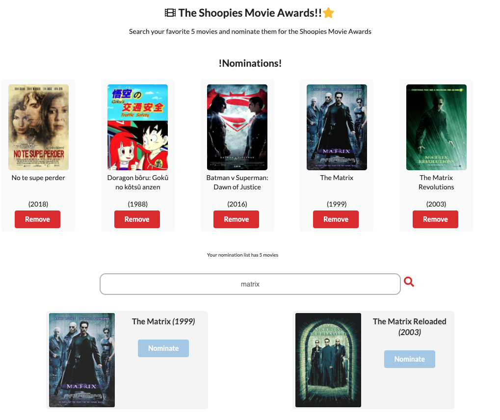
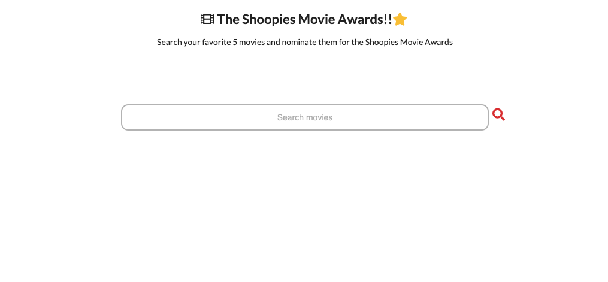
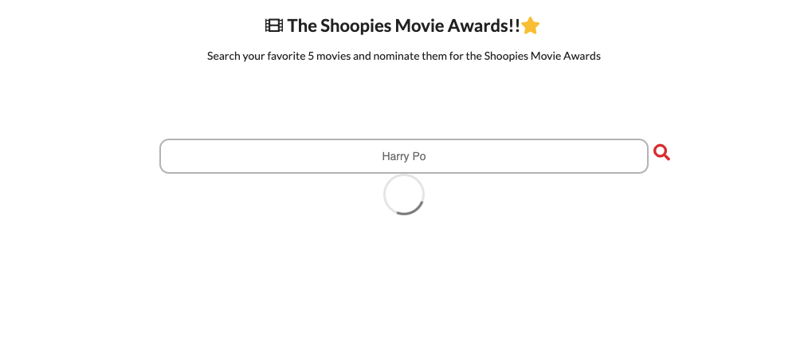
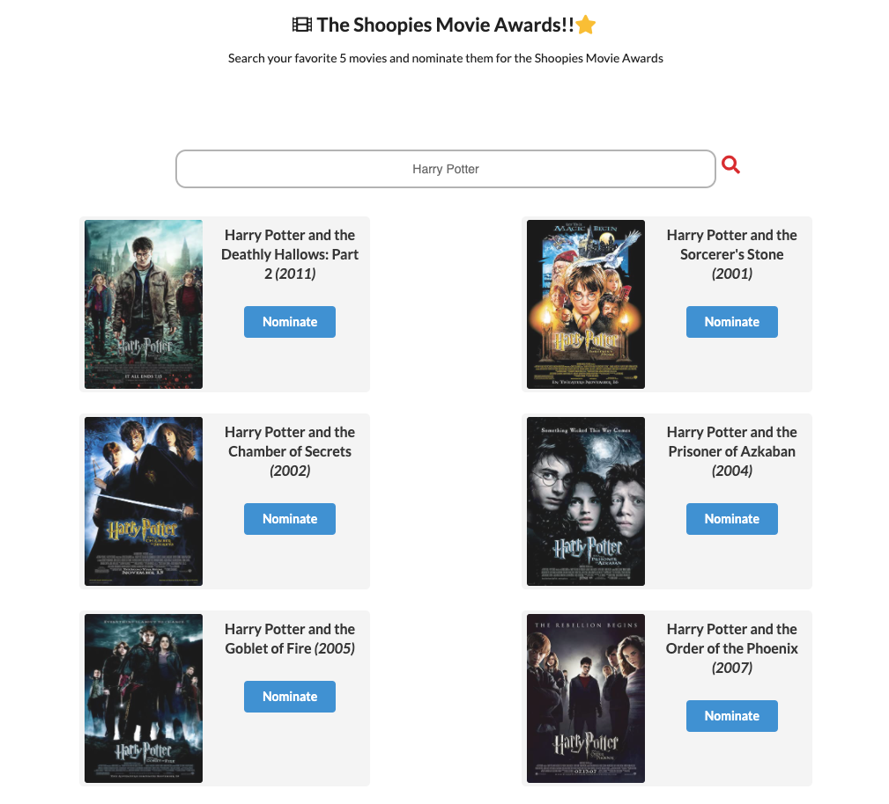
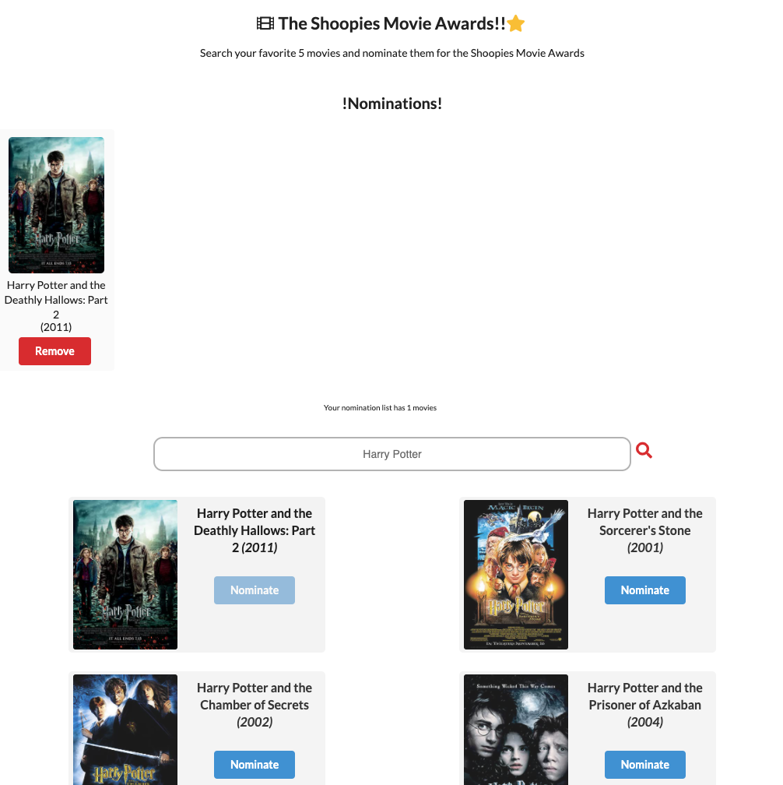
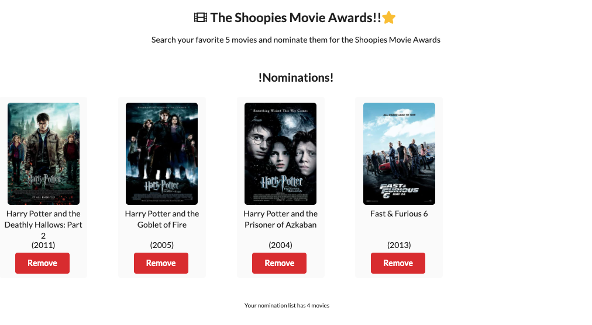
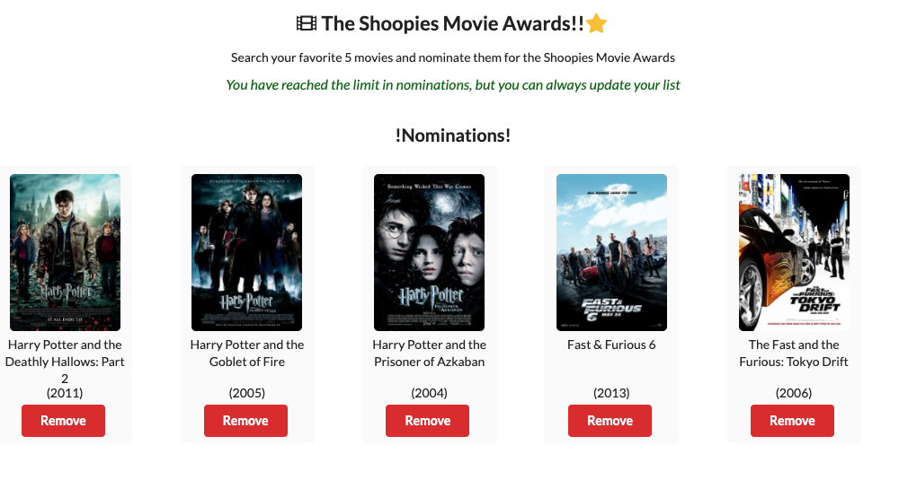
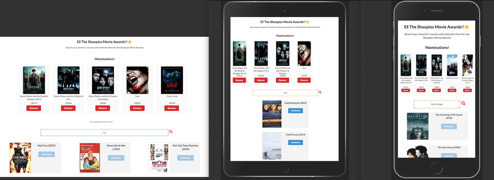

# The Shoopies Movie Awards! 

The Shoopies Movie Award is an one page web application that allows the user to search for movies, nominate them, and have a list of a total of five nominations.

 

User will be able to search from a OMDb API that will yield results of movies with titles, years, and posters.  
While the search is happening, the movies will be render onto the page for the user to pick, if no results are being render, then a loader spinner will show on the page.   The user can have a list of up to 5 nominations. This list is editable, user can add, and remove from it. Once the Nomination list has a total of 5 movies, a banner will show, alerting the user that the limit has been reached.

## A Walkthrough on this app

The first thing you will see when using this application is the search bar in the page. 

 
This is prompting the user to search for movies, as soonest the search is ignite, the system will either show the results, or if the results are yet to be fetch, it will show a loader spinner 

 
Users can add the movie of thier choice into the Nomination List as such 

 
they can update the Nomination list by removing movies as well. 

 
Once the Nomination List has a total of 5 movies, a banner will appear alerting the user that a limit has be reached for the Nomination list 

 
 
This is an application that can be use in all devices

## Visit the Deploy site

<a href='https://the-shoopies-awards.netlify.app/'>The Shoopies Movie Awards </a>

## Technical Overview

This project was build with React.Js and elements from Semantic UI. 
There is a great use of 'localStorage' to save the nomination list result even if the user leaves the page, or reloads it.

